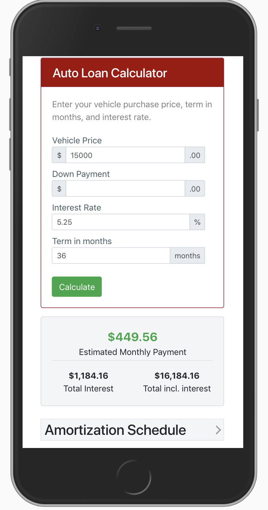

# Auto Loan Calculator
` with Amortization Schedule`
> This Auto Loan calculator was built using Bootstrap and ES6 classes. Calculates an *estimated* monthly payment and amortization
schedule.
>View live [example](http://joiwhitmore.com/projects/auto-loan-calculator/ "Auto Loan Calculator").

## Features
* >Updates on input change.
* >Responsive design for optimal viewing on mobile devices

  
 
 ## Dependencies
* [Bootstrap](https://getbootstrap.com/)
 
 ## Author
 
 * **Joi Whitmore**