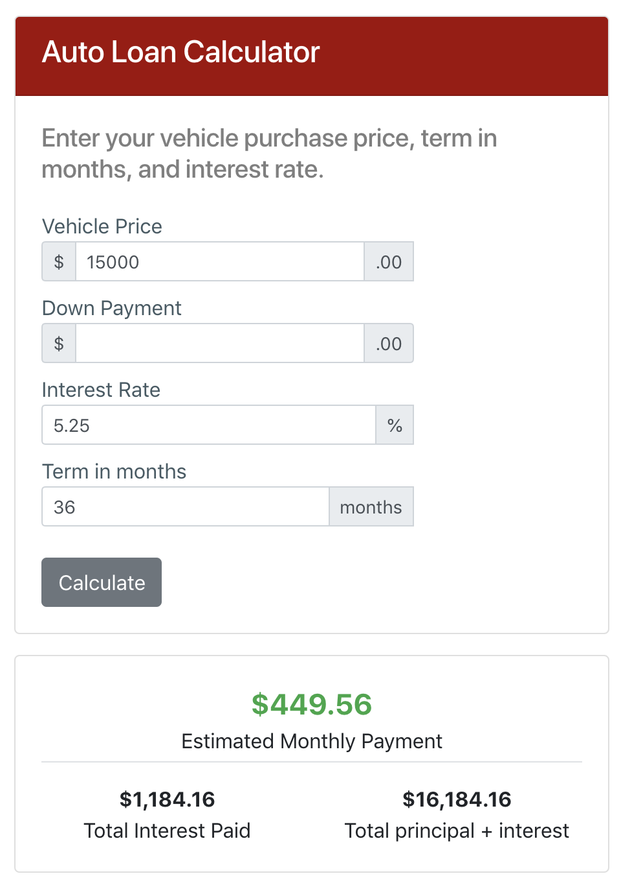

# Auto Loan Calculator
` with Amortization Schedule`
> This Auto Loan calculator was built using Bootstrap and ES6 classes. Calculates an *estimated* monthly payment and amortization
schedule. Updates on input change.

>View live [example](http://joiwhitmore.com/projects/auto-loan-calculator/ "Auto Loan Calculator").

  
 
 ## Dependencies
 <ul>
 <li>Bootstrap</li>
 </ul>

